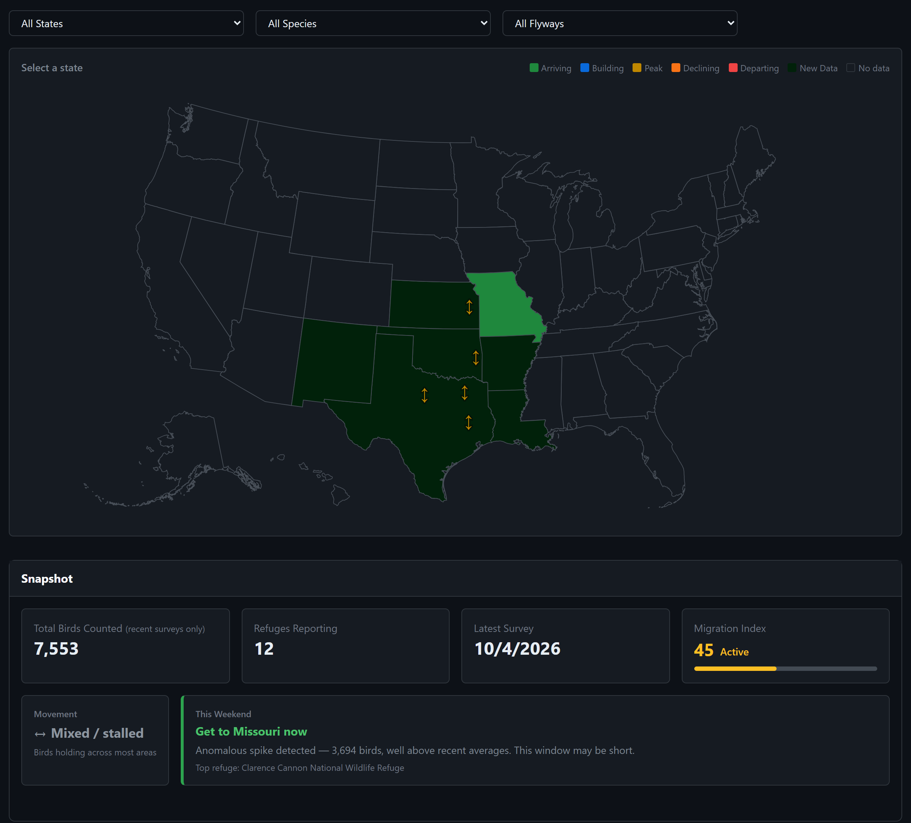
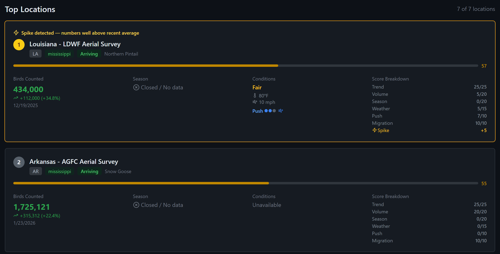
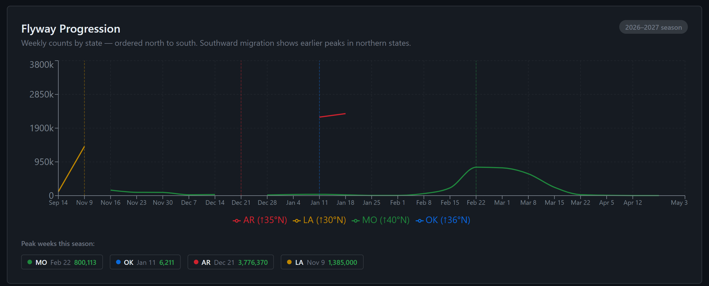
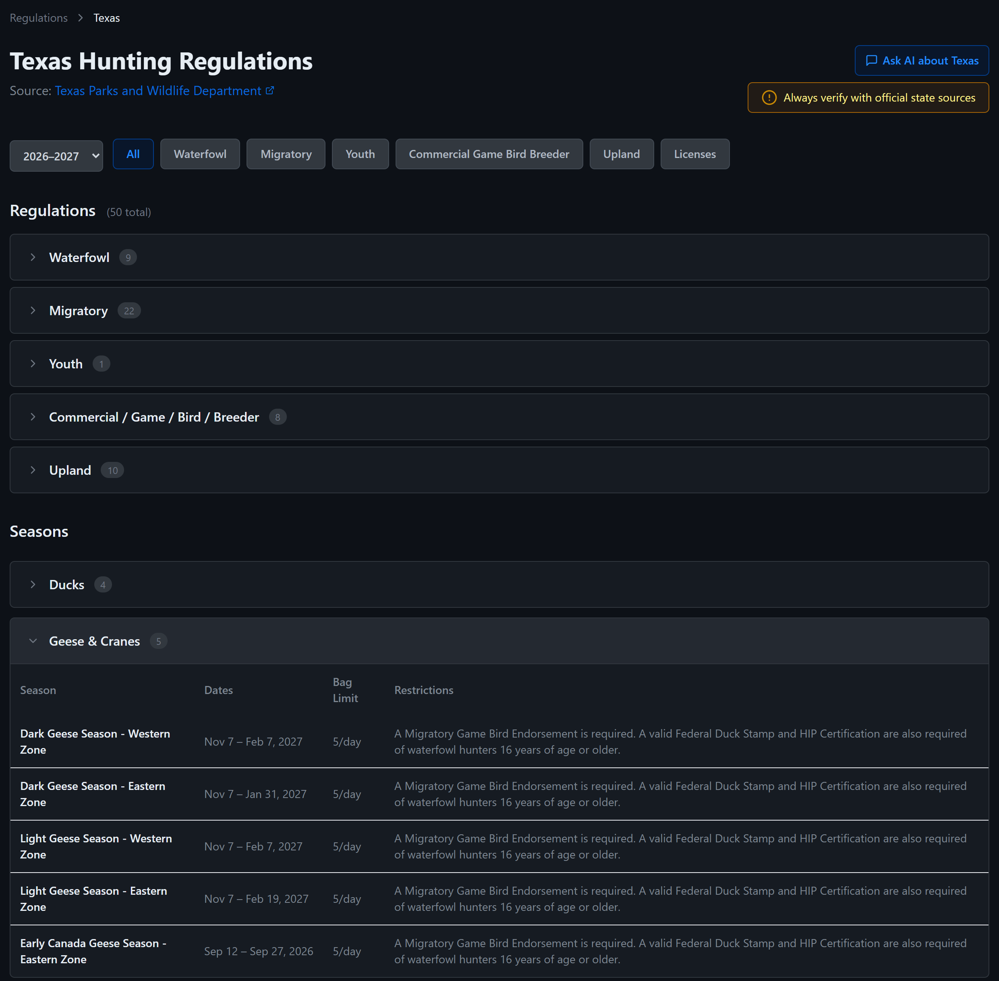
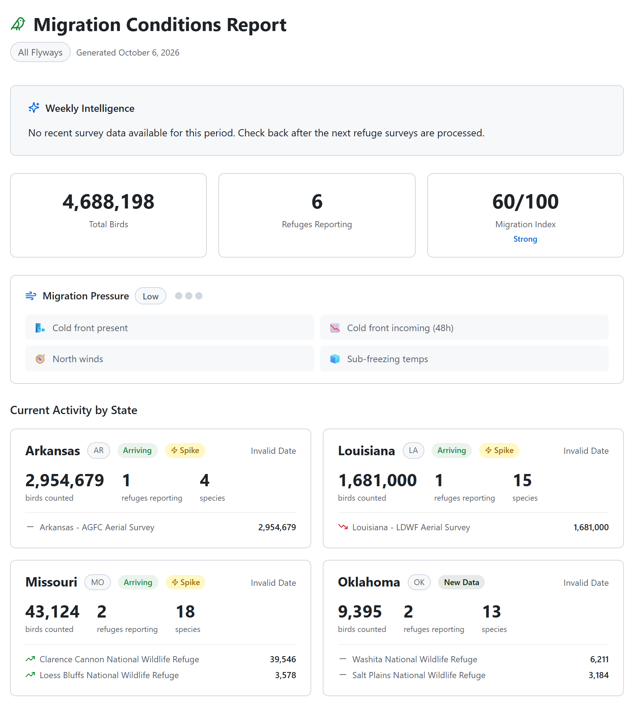

<h1 align="center">
  
  huntstack
</h1>

<p align="center">
  <i>Pre-hunt intelligence for waterfowl hunters: live refuge counts, migration timing and season rules, searchable, in one place.</i>
</p>

<h4 align="center">
  <a href="https://github.com/njcurtis3/huntstack/actions/workflows/ci.yml">
    
  </a>
  <a href="#license">
    
  </a>
  
  <br>
  
  
  
  
  
</h4>

<p align="center">
  <a href="#install">Install</a> ·
  <a href="#run">Run</a> ·
  <a href="#scrapers">Scrapers</a> ·
  <a href="#api">API</a> ·
  <a href="#data-sources">Data sources</a> ·
  <a href="#environment">Environment</a> ·
  <a href="#roadmap">Roadmap</a> ·
  <a href="apps/mobile/README.md">Mobile app</a>
</p>

<p align="center">
  
</p>

## Introduction

`huntstack` replaces the way waterfowl hunters plan today: Googling across six
state websites, reading three PDFs, and scrolling Facebook groups for refuge
reports. It pulls federal and state aerial surveys, eBird sightings, NOAA
weather and state regulations into one structured dataset, and answers the
question that matters before a hunt: *where should I go this weekend?*

It does not try to be a map. OnX, HuntStand and BaseMap own in-field
navigation. **HuntStack tells you where to hunt; OnX helps you get there.**

V1 covers waterfowl in the Central and Mississippi Flyways: TX, NM, AR, LA,
KS, OK and MO.

> [!WARNING]
> **HuntStack is pre-beta.** The migration dashboard, recommendations, chat
> and regulations are built and running, but the app is not yet open to the
> public. Season dates are extracted from state documents and are still being
> spot-checked by hand. **Always confirm seasons, bag limits and shooting
> hours with the state agency before you hunt.**

<details open>
<summary>
 Features
</summary> <br />

<p align="center">
  
&nbsp;
  
</p>

<p align="center">
  
&nbsp;
  
</p>

<table>
  <tr>
    <td width="50%"><b>Migration Intelligence</b> (<code>/migration</code>)<br>Live and historical counts from refuge aerial surveys, updated weekly. See which refuges have birds arriving, peaking or moving out, with week-over-week deltas, species-level trends and an AI-written weekly narrative per state.</td>
    <td width="50%"><b>Where to Hunt</b> (<code>/where-to-hunt</code>)<br>Enter a species and a city, zip or GPS fix, and get public hunting areas ranked by bird activity, migration status, push factor, open seasons, weather and distance, with the score broken down on every card.</td>
  </tr>
  <tr>
    <td><b>Push factors and flyway flow</b><br>Cold fronts, north winds and sub-freezing temps from NOAA, scored per state. Flyway arrows on the map show which way the birds are moving, inferred from N→S count changes.</td>
    <td><b>AI chat</b> (<code>/chat</code>)<br>Ask <i>"What do I need to hunt snow geese in New Mexico?"</i> or <i>"Where are the pintails right now?"</i> RAG over structured data and source documents, rate-limited per IP.</td>
  </tr>
  <tr>
    <td><b>Regulations and licenses</b> (<code>/regulations</code>)<br>Seasons, bag limits, shooting hours, stamps and license requirements for TX, NM, AR, LA, KS and OK, with a side-by-side state comparison, instead of a stack of PDFs.</td>
    <td><b>Regional activity</b><br>eBird community observations for every V1 state, rated High, Moderate or Low against the prior 14 days, with the top species per state and per-refuge sightings.</td>
  </tr>
  <tr>
    <td><b>My Area and reports</b><br>Find the nearest active refuges from a city, zip or GPS, and share a snapshot of current conditions (<code>/report</code>) filtered by state and species.</td>
    <td><b>Native app</b> (<code>apps/mobile</code>)<br>An Expo app with Where to Hunt on your phone, talking to the same API. Runs in Expo Go today; see <a href="apps/mobile/README.md">its README</a>.</td>
  </tr>
</table>

</details>

## Install

<details open>
<summary>
 Prerequisites
</summary> <br />

- Node.js 22 or later, and pnpm 8 or later
- Python 3.11 or later (for the scrapers)
- A Supabase project with the `postgis` and `vector` extensions enabled
- A Together.ai API key, an OpenAI API key (embeddings), and an eBird API key

</details>

```bash
git clone https://github.com/njcurtis3/huntstack.git
cd huntstack
pnpm install
```

Create a `.env` at the repo root with the variables under
[Environment](#environment), then run `scripts/init-supabase.sql` in the
Supabase SQL editor.

> [!CAUTION]
> **Never run `pnpm db:push` or `drizzle-kit push`.** Drizzle will try to drop
> the pgvector `embedding` column. Make every schema change in raw SQL.

## Run

```bash
pnpm dev          # API and web together
pnpm dev:web      # web only, http://localhost:3000
pnpm dev:api      # API only, http://localhost:4000 (Swagger at /docs)
```

Tests:

```bash
pnpm --filter @huntstack/api test                # API (vitest)
cd apps/scrapers-python && python -m pytest      # scraper parsers (pytest)
```

## Scrapers

```bash
cd apps/scrapers-python

python -m huntstack_scrapers.scrapers.run refuge_counts               # every source
python -m huntstack_scrapers.scrapers.run refuge_counts --source "Loess Bluffs National Wildlife Refuge"
python -m huntstack_scrapers.scrapers.run refuge_counts --dry-run     # parse only, no DB writes
python -m huntstack_scrapers.scrapers.run state_regulations --state TX
```

On the dev machine, `scripts/run-refuge-counts.ps1` runs the refuge counts
every Monday at 6am through Windows Task Scheduler, logs to `scripts/logs/`,
and posts to `SCRAPER_ALERT_WEBHOOK` when a run fails or finds nothing.

<details>
<summary>
 Data sources
</summary> <br />

<a id="data-sources"></a>

| Source | State | Type | Frequency |
|---|---|---|---|
| Washita NWR | OK | FWS HTML survey | weekly |
| Salt Plains NWR | OK | FWS HTML survey | weekly |
| Clarence Cannon NWR | MO | FWS HTML table | weekly |
| Loess Bluffs NWR | MO | FWS PDF survey | weekly |
| AGFC aerial survey | AR | state PDF, LLM-extracted | biweekly |
| LDWF aerial survey | LA | state PDF, LLM-extracted | monthly |
| Midwinter Waterfowl Inventory | TX, NM, AR, LA, KS, OK | USFWS survey | annual |
| eBird | TX, NM, KS, OK, AR, LA, MO | Cornell Lab, statewide and per refuge | on demand, cached 3h |

PDFs are extracted with `Llama-3.3-70B-Instruct-Turbo` on Together.ai at
temperature 0.

</details>

<details>
<summary>
 Tech stack
</summary> <br />

| Layer | Technology |
|---|---|
| Web | React 18, Vite, TypeScript, Tailwind CSS, Zustand, TanStack Query |
| Maps and charts | react-simple-maps (AlbersUSA SVG), Recharts |
| Mobile | React Native, Expo, expo-router |
| API | Fastify 4, TypeScript, Drizzle ORM, Zod |
| Database | Supabase: PostgreSQL, PostGIS, pgvector |
| LLM | Together.ai: Llama 3.3 70B |
| Embeddings | OpenAI: text-embedding-3-small at 1024 dims |
| Scrapers | Python, Scrapling, pdfplumber |
| Weather, birds, geocoding | NOAA, eBird, Nominatim |
| Errors | Sentry, errors only |
| Monorepo | pnpm workspaces |

</details>

<details>
<summary>
 Project structure
</summary> <br />

```
huntstack/
├── apps/
│   ├── web/                  # React + Vite frontend
│   ├── mobile/               # Expo native app
│   ├── api/                  # Fastify backend: routes, NOAA, RAG, embeddings
│   └── scrapers-python/      # scrapers, parsers, LLM/PDF extractors, source registry
├── packages/
│   ├── db/                   # Drizzle schema and migrations
│   └── shared/               # Zod schemas and shared utilities
│   └── types/                # shared TypeScript types
├── scripts/                  # seed scripts, weekly scraper, logs
└── .github/workflows/ci.yml  # typecheck, tests and build on every push and PR
```

</details>

## API

<details>
<summary>
 Routes
</summary> <br />

| Route | What it returns |
|---|---|
| `GET /api/refuges` | refuges, filterable by state and flyway |
| `GET /api/refuges/:id/counts` | a refuge's count time series, with delta and trend |
| `GET /api/refuges/migration/dashboard` | migration data across every refuge, eBird included |
| `GET /api/migration/push-factors` | push factor scores per state |
| `GET /api/migration/weekly-summary` | the AI weekly narrative, cached 6h |
| `GET /api/migration/flyway-progression` | weekly counts by state, N→S |
| `GET /api/migration/regional-activity` | eBird activity per state, vs the prior 14 days |
| `GET /api/hunt/recommendations` | ranked recommendations by species and location |
| `GET /api/geo/zip/:zip` · `/search?q=` · `/reverse?lat=&lng=` | geocoding through Nominatim |
| `GET /api/weather/forecast/:refugeId` · `/alerts` · `/hunting-conditions/:refugeId` | NOAA weather |
| `POST /api/chat` | RAG chat over structured data |
| `GET /api/search` | full-text search across regulations, species and locations |
| `GET /api/regulations` · `GET /api/species` | regulations and the species catalog |

Swagger runs at `http://localhost:4000/docs`.

</details>

## Environment

<details>
<summary>
 Variables
</summary> <br />

```bash
DATABASE_URL=postgresql://...
SUPABASE_URL=https://...
SUPABASE_ANON_KEY=
SUPABASE_SERVICE_KEY=
VITE_SUPABASE_URL=
VITE_SUPABASE_ANON_KEY=
TOGETHER_API_KEY=
OPENAI_API_KEY=            # embeddings; chat works without it, semantic search does not
EBIRD_API_KEY=
VITE_API_URL=http://localhost:4000
VITE_MAPTILER_KEY=
PORT=4000
CORS_ORIGIN=http://localhost:3000
SENTRY_DSN=                # optional
VITE_SENTRY_DSN=           # optional
SCRAPER_ALERT_WEBHOOK=     # optional
```

</details>

## Roadmap

<details>
<summary>
 Done
</summary> <br />

- [x] Refuge count pipeline: live FWS and state sources, plus eBird
- [x] Migration dashboard: counts, week-over-week deltas, trends, flyway map and flow arrows
- [x] Push factors from NOAA, and the AI weekly narrative
- [x] eBird regional activity for every V1 state
- [x] My Area proximity search, and shareable reports
- [x] Where to Hunt: scored recommendations
- [x] AI chat over structured data and documents
- [x] Regulations and licenses for TX, NM, AR, LA, KS and OK, with state comparison
- [x] 2026–2027 season data
- [x] Native app (Expo), Where to Hunt first
- [x] Dark and light mode
- [x] CI, weekly scraper, chat rate limit, Sentry

</details>

<details>
<summary>
 Next
</summary> <br />

- [ ] Hand spot-check of extracted 2026–2027 season dates
- [ ] More live sources for KS and NM
- [ ] Push notifications (*"Snow geese numbers jumped at Loess Bluffs"*)
- [ ] Accounts and saved locations
- [ ] Outfitter directory beyond Texas
- [ ] Web tests

Later, once V1 has traction: public land layers, predictive migration
models, crowdsourced harvest reports, and big game (elk and deer in CO, MT
and WY).

</details>

## License

**Private.** © 2026 Nathan Curtis. All rights reserved.

This repository is public for viewing only. No permission is granted to copy,
modify or redistribute it without explicit written permission.
